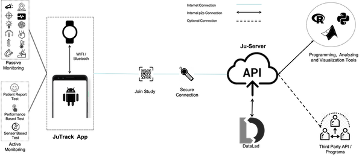

.. JTrack_social_docs documentation master file, created by
   sphinx-quickstart on Sun May  3 16:57:11 2020.
   You can adapt this file completely to your liking, but it should at least
   contain the root `toctree` directive.

Welcome to JTrack Platform
==============================================

JTrack is a platform for remote assessments of an individual's data in situ using smartphones.
JTrack is more than a single application, you can create, manage a study and, share your collected data using one platform.

A wide range of measurements using motion sensors (e.g. acceleration, gyroscope) as well as social activities (e.g. time spent in social networks) are extracted from the device while it is being used. Recorded are activity types (e.g. walking, running), relative location, and ecological momentary assessments.
you may perform **Active** and **Passive** data collection and adopt the open-source codes for further requirements.

JTrack platform includes:

* Android application 
* Python dashboard 
* python server API

|
|

|
|

.. toctree::
   :maxdepth: 2

   JTrack_Social
   JTrack_Dashboard
   JServer
   developers
    

How to Cite :
+++++++++++++

Contact Us:
+++++++++++
Interested in using JTrack in you study? contact us:

|

To contribution as a development please check :doc:`/developers` page. 

.. * :ref:`genindex`
.. * :ref:`modindex`
.. * :ref:`search`
